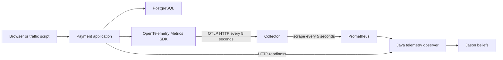
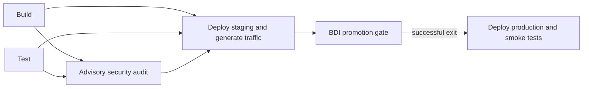
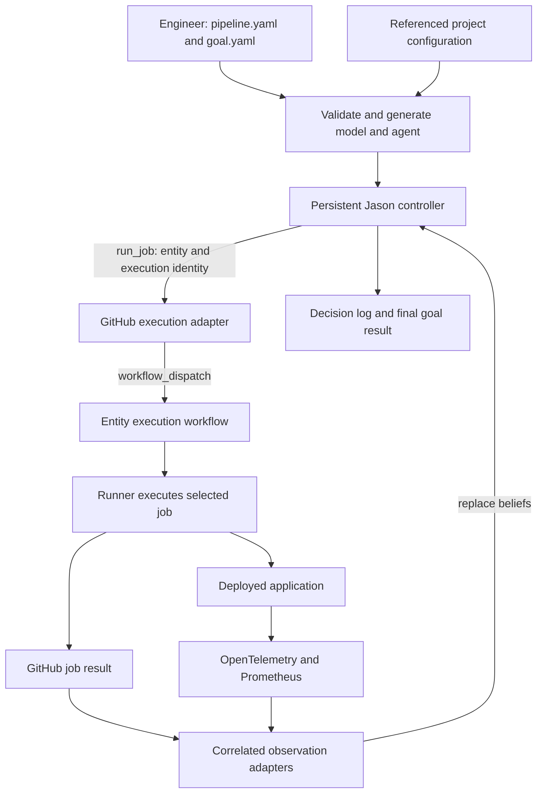

# BDI CI/CD architecture audit and implementation plan

Current update (20 September 2026): the active launcher uses `01_pipeline.yaml` / `02_goal.yaml`, generates the controller model/agent, and implements conditional BDI-selected recovery plus production/recovery telemetry verification. The numbered files are logical policy inputs; commands stay in the dispatch workflow. See [the current manual](BDI_LIVE_MANUAL_DEMO.md) and [results](BDI_CONTROLLER_EXPERIMENT_RESULTS.md). Statements below about a gate-only architecture or absent automatic recovery describe the original audit baseline.

Audit date: 19 September 2026. Repository: `260031_payment`, branch `experiment-v2`, commit `f658daf`.

**Finding:** The repository implements a payment application with OpenTelemetry **metrics** and a GitHub Actions deployment pipeline. Its active BDI integration is a promotion gate. GitHub Actions owns progression; Jason can prevent production deployment but cannot select or launch the pipeline's jobs. The generated agent and an older dispatch adapter provide useful parts of a controller, but they are not connected to the active execution path.

**Recommendation:** Run one generated Jason agent for the duration of a release, starting before build. Connect its `run_job(Entity)` action to a dispatch-only GitHub workflow that executes exactly one selected entity. Keep dependencies, retry decisions, telemetry waits, and progression in AgentSpeak. Reuse the existing job implementations, parser, observation interfaces, Prometheus integration, and logging.

> **Implementation status, 19 September 2026:** Milestones A–F below are now implemented in the working tree. The controller uses `payment_pipeline.yaml`, a selected goal file, and its referenced project manifest; generates and starts one headless Jason agent; dispatches independent entity workflows; journals correlated evidence; and produces explicit outcomes. The actual Jason scenario matrix and current external blockers are recorded in [BDI_CONTROLLER_EXPERIMENT_RESULTS.md](BDI_CONTROLLER_EXPERIMENT_RESULTS.md). Sections describing the “current” gate architecture below retain the audited baseline for comparison.

## 1. Scope and evidence

The inspection covered application source, UI, SQL migrations, tests, scripts, deployment and telemetry configuration, the workflow, existing documentation, and every source/configuration area of `bdi-cicd-framework/`, including inactive implementations. Installed dependencies, compiled output, wrapper binaries, Gradle caches, and generated reports were inventoried as supporting artifacts rather than treated as application source. Only `.env` variable names were inspected; secret values were not needed.

This is a source and architecture audit, not a new live deployment verification. No workflow was dispatched, service restarted, traffic generated, or application/framework code changed. The only intended addition is this document. A pre-existing modification to `bdi-cicd-framework/config/.gradle/9.2.0/fileHashes/fileHashes.lock` was left alone.

An in-memory invocation of the existing parser confirmed that the checked-in payment workflow model, generated beliefs, and generated payment agent exactly match the current inputs and template. No generated files were rewritten. An existing Java test report records four passing tests; it is historical evidence, not a test run performed for this audit. The repository's experiment guide explicitly describes local fixture-based validation and says live GitHub integration remains unverified. Runner registration, repository environment protections, and actual deployed containers cannot be established from these files alone.

| Area inspected | Current purpose and authoritative files |
|---|---|
| Application | Node.js/TypeScript/Fastify, direct `pg` database access, fake and optional Stripe providers: [app.ts](../src/app.ts), [payments.ts](../src/payments.ts), [providers.ts](../src/providers.ts), [config.ts](../src/config.ts). Drizzle appears in planning material but is not the implementation. |
| UI and persistence | [ui.ts](../src/ui.ts), the actively imported [payment-page.ts](../src/payment-page.ts), and [SQL migrations](../src/db/migrations/). `ui.ts` also contains an unused older payment-page implementation. |
| Packaging and execution | [package.json](../package.json), lockfile, [Dockerfile](../Dockerfile), [Compose](../docker-compose.yml), and [ci-cd.yml](../.github/workflows/ci-cd.yml). |
| Telemetry and experiments | [telemetry.ts](../src/telemetry.ts), [experiment.ts](../src/experiment.ts), [collector](../otel-collector.yaml), [Prometheus](../prometheus.yml), and [scripts](../scripts/). |
| Framework models/parser | [model_transform.py](../bdi-cicd-framework/parser/model_transform.py), parser tests, payment and sample pipeline/goal/model files under [models](../bdi-cicd-framework/models/). |
| Framework generator | [bdi_generic.asl](../bdi-cicd-framework/generator/bdi_generic.asl), generic/sample generated files, and payment generated beliefs/agent. |
| Framework runtime | Both MAS entry points, gate and replay environments, observation/belief interfaces, GitHub observers/executor, correlation/logging, mocks/scenarios, fixtures, and Java tests under [bdi](../bdi-cicd-framework/bdi/). |
| Framework monitoring/actions | Current Prometheus reader plus older telemetry adapter, classifiers, audit sinks, shell actions, allowlisting, and attempt budgets under [monitoring](../bdi-cicd-framework/monitoring/) and [actions](../bdi-cicd-framework/actions/). |
| Build/configuration | Active [bdi/build.gradle](../bdi-cicd-framework/bdi/build.gradle), wrapper configuration, and older [config/build.gradle](../bdi-cicd-framework/config/build.gradle). The latter expects a `project.mas2j` in its own directory, which is absent. |
| Documentation/history | Root README/PROJECT, all existing `docs/`, framework READMEs, and recent Git history. Several planning documents describe earlier or proposed behavior. |

## 2. Current end-to-end behavior

### Application and telemetry

The browser moves through checkout, payment, and receipt pages. Fake payments are recorded in PostgreSQL; optional Stripe paths create PaymentIntents and process signed webhooks. Compose starts PostgreSQL, the application, an OpenTelemetry Collector, and Prometheus. The application container applies SQL migrations before starting the server. The framework is excluded from the application's Docker build and does not run inside its container.

The observation path is:



Instrumentation is explicitly implemented in [telemetry.ts](../src/telemetry.ts). It records HTTP request/error counters, a duration histogram, a database/readiness gauge, and payment outcome counters. Telemetry is disabled when the OTLP metrics endpoint is absent; Compose supplies it. There is no configured OpenTelemetry trace pipeline or OpenTelemetry log pipeline. Fastify application logs and collector debug output are separate logs.

HTTP and readiness metrics carry `ci_run_id`. The payment outcome counter does **not** carry that label. A rejected fake payment can return HTTP 201: its business outcome is failed, but it is not an HTTP server error. The BDI promotion queries use `/payments` **5xx rate**, p95 latency, and readiness, not business rejection counts or the all-route 4xx/5xx percentage shown by `telemetry:show`.

The [project manifest](../bdi-cicd-framework/models/payment_project.yaml) supplies PromQL queries and thresholds: error rate greater than 5%, p95 latency greater than 500 ms, or readiness below 1 prevents a healthy assessment. Rate/histogram queries use a two-minute window. Missing/nonfinite query results become `unknown`. Prometheus keeps seven days of local samples; the collector expires metrics after 15 seconds without updates. The reader does not independently validate sample age or scrape-target health on every assessment, so “fresh” currently means available run-filtered query results, not a complete freshness guarantee.

### GitHub Actions execution

The exact job graph in [ci-cd.yml](../.github/workflows/ci-cd.yml) is:



Build and test start independently; they are **not** sequential. Build compiles TypeScript and builds a Docker image on `ubuntu-latest`. Test starts PostgreSQL, applies migrations, runs Vitest, and runs Python parser tests. Security waits for both; `npm audit` uses `continue-on-error`, so its findings are advisory.

Pull requests run build, test, and security. Deployment is restricted to `main` pushes or manual runs on `main`. Those runs deploy staging through Docker Compose on a self-hosted runner, check health/readiness and telemetry availability, generate fake-payment traffic, and wait for finite run-specific Prometheus results. Then they start the BDI gate. Production runs only after the gate job succeeds, using the `production` GitHub Environment and its externally configured protections, if any.

Staging uses app/collector/Prometheus ports `3001/9465/9091`; production uses `3000/9464/9090`. All deployment/gate jobs use only `runs-on: self-hosted`. This does not pin them to one machine, although their loopback URLs require access to the same deployment host. Compose uses separate project names and data volumes for the two environments.

Both deployments execute `docker compose up -d --build`. The build job's Docker image is not uploaded or promoted as an artifact. Deployment rebuilds source on the self-hosted host. The workflow also uses branch-scoped cancellation (`cancel-in-progress: true`). Those are GitHub execution choices, not BDI decisions.

### The active BDI gate

The actual call chain is:

```text
ci-cd.yml: bdi-gate
  -> Gradle gate
  -> ProjectGateMain
  -> gate.mas2j
  -> ProjectGateEnvironment + gate_agent.asl
  -> process exit -> GitHub job result -> production needs condition
```

[ProjectGateEnvironment](../bdi-cicd-framework/bdi/harness/ProjectGateEnvironment.java) polls the current GitHub run and staging telemetry, then publishes `promotion_goal(Target)`, `workflow_state(...)`, `telemetry_state(...)`, and `evidence_round(...)`. It loads `payment_project.yaml`, or the configured replacement. It explicitly rejects fixture use inside Actions and requires the observed run ID to match the current Actions run.

[GitHubRunObserver](../bdi-cicd-framework/bdi/harness/GitHubRunObserver.java) performs read-only Jobs API requests, mapping display names to logical roles. It reads the first 100 latest jobs of a single run. [GateEvidence](../bdi-cicd-framework/bdi/harness/GateEvidence.java) requires every mapped role except the promotion target to succeed; it does not derive the target's prerequisites from the generated model.

[ProjectTelemetryProvider](../bdi-cicd-framework/bdi/harness/ProjectTelemetryProvider.java) does the numeric threshold classification in Java. [gate_agent.asl](../bdi-cicd-framework/bdi/gate_agent.asl) chooses `block` on confirmed workflow/telemetry failure, `allow` when both are acceptable, and otherwise waits for another observation. [ProjectGateMain](../bdi-cicd-framework/bdi/harness/ProjectGateMain.java) imposes a default 90-second watchdog that exits as `unknown`. JVM results are 0/1/2; Gradle reports either nonzero JVM result as a failed task.

**The gate does not load `payment_goal.yaml`, `payment_workflow_model.yaml`, or `payment_bdi_agent.asl`.** Its promotion policy is handwritten. Generation is a separate developer command, not a stage that feeds the gate at runtime.

The high-error experiment works because the staging traffic helper accepts the intentionally injected 503 responses while the gate detects their rate. Production is skipped and its earlier deployment remains. Other failures can stop earlier: for example, the workflow's readiness smoke test rejects `unhealthy` staging before the BDI gate starts.

## 3. What each framework path actually controls

| Path | Selected by | What BDI can do | What executes work |
|---|---|---|---|
| Active promotion gate | `gate` task and `gate.mas2j` | Allow, block, or wait for promotion evidence | Existing GitHub DAG; gate has `actions: read` only |
| Generated payment replay | `runBaseline`, `project.mas2j` | Choose which existing job to observe; evaluate generated dependency/goal facts | `ProjectRunEnvironment` wires `ObservedRunExecutor`, whose `runJob` only waits for an existing job to finish |
| Older GitHub controller wiring | `GitHubEnvironment` and `GitHubActionsWorkflowExecutor` | Intended to dispatch a selected entity | No checked-in MAS selects it; its default `entity-execution.yml` does not exist |
| Older local shell controller | `deployment_agent.asl` and `CicdEnvironment` | Handwritten build/test/deploy/recovery sequence and telemetry reactions | Calls `cicd/actions/*.sh`, which are absent from this application; not the active MAS |
| Mock/scenario harnesses | Mock/Scenario environments and executors | Simulate success, retries, failures, and recovery | In-memory outcomes; not evidence of real runner execution |

The generic [AgentSpeak template](../bdi-cicd-framework/generator/bdi_generic.asl) already contains `nextentity`, dependency checks, `run_job`, retry budgets, recovery relations, maintenance checks, and goal assessment. It selects one running entity at a time. This is reusable scheduling logic, but its current runtime binding makes it an observer in the payment baseline.

The payment model sets `max_retries: 0` and has no recovery actions. Its generated promotion rule immediately stops on missing/blocked telemetry; it does not reproduce the active gate's bounded wait-and-reobserve behavior. The generic runtime-degradation plan listens for `status(Entity, fail)`, while the current telemetry belief adapter publishes `health(...)`/`gate(...)`. The comment claiming health is normalized to execution failure is therefore not an implemented connection.

The dormant dispatcher is a starting point, not a switch that can simply be enabled. It has fixed entity names/environment mappings, an old fault-injection input contract, in-memory correlation, regex JSON parsing, and rollback selection based on the current successful build. Its companion telemetry adapter expects older metric names and `/pay`; the current application uses different metrics and `/payments`. Reuse the configurable current Prometheus provider instead.

| Responsibility | Current owner | Intended owner |
|---|---|---|
| Start a release | GitHub event | Engineer/trigger starts the BDI release process |
| Choose initial and subsequent jobs | GitHub `needs` and conditions | Generated AgentSpeak plans using model/goal beliefs |
| Queue jobs, select runners, execute steps | GitHub Actions and runner | GitHub Actions and runner |
| Interpret job/telemetry data | Java adapters, with a final Jason gate decision | Java produces correlated facts; Jason chooses actions |
| Decide retry, wait, stop, or configured recovery | No active BDI execution capability | Jason throughout the release |
| Decide whether to request production | Gate permits a predeclared successor | Jason explicitly dispatches production |
| Enforce environment approvals | GitHub repository settings | GitHub remains an external execution constraint |
| Assess configured goals and finish | Gate policy and workflow completion | Generated goals and an explicit controller result |

## 4. Why the implementation became a gate

The evidence points to a deliberate narrowing of the integration, not a limitation of Jason or GitHub Actions:

1. **The existing GitHub DAG was preserved.** Commit `f658daf` is titled “Integrate BDI staging-to-production gate.” It inserted `bdi-gate` between staging and production and changed production's `needs` from staging to the gate. It did not replace the executor contract or move scheduling out of GitHub.
2. **The chosen runtime is read-only.** The workflow launches `gate`, grants only Actions-read access, and starts the gate MAS. The generated replay MAS likewise uses a read-only executor. Neither can dispatch a job.
3. **The generator describes the existing workflow rather than changing execution ownership.** `parse_project_pipeline` reads `needs`, maps job IDs to stable roles, and collapses the infrastructure gate into a logical staging-to-production edge. It emits model/belief/agent files, but no execution workflow or controller startup wiring.
4. **Goal generation is disconnected from the live decision.** The gate receives a promotion target from the project manifest and uses separate handwritten plans. Changing the goal YAML does not change the active gate's reasoning.
5. **The missing boundary is one independently executable entity.** There is only one registered workflow, whose manual input is `experiment_mode`. Dispatching it starts the full predefined pipeline; it cannot accept `entity=build` or `entity=test`.
6. **Validation was scoped to a promotion experiment.** [BDI_EXPERIMENT.md](BDI_EXPERIMENT.md) explicitly defines pre-production adaptation. Parser tests even assert the gate's placement and read-only permission. Those checks validate the delivered gate architecture, not the intended controller architecture.

This establishes how the code ended up with gate behavior. It does not establish any undocumented author motivation. Earlier plans mentioning rollback or an artifact-based pipeline describe ambitions or other prototypes: the current application has neither a rollback job nor an image promotion contract.

## 5. Smallest practical controller architecture

### One controller process and one dispatch-only workflow

For the first demo, start the controller as a foreground process on the deployment VM/WSL host, in a checkout separate from the runner's work directory. It can then reach the existing loopback telemetry endpoints and GitHub's API. Start it before build; keep the same agent alive until the release reaches a terminal outcome. The process must not occupy the only self-hosted runner slot while waiting for jobs that need that runner.



Add `.github/workflows/entity-execution.yml`. Move/reuse the current five application job bodies there. Each application job has only an input selector such as `if: inputs.entity == 'staging'`; it has no dependency on other application entities. Build/test can retain hosted runners and service containers; deployment jobs retain their specific self-hosted host label and GitHub Environment. The worker owns the ordered implementation steps **inside** a job. It never picks the next entity or retries a failed entity.

Use a small validation job, if needed, to reject invalid inputs before the selected job runs. A dependency on this validation job is execution plumbing; a dependency from staging to production would restore GitHub orchestration and must not be present. Validate the selected job's actual completion, because a run containing only skipped jobs must not count as successful execution.

Keep existing PR checks separate. At controller cutover, remove/disable the old automatic deployment chain for controlled releases so the same release cannot be deployed by two owners. The first demo can start releases manually through the controller. A later push trigger may start the controller, but should contain no release-stage ordering policy.

### Keep the inputs reusable and authoritative

Create a logical `models/payment_pipeline.yaml` outside `.github/workflows/`. It declares entity IDs and dependency relationships. Keep the existing project manifest for runner execution mappings, endpoints, metric queries, thresholds, and application-specific inputs. Let the pipeline reference that manifest, so the engineer's entry point remains `pipeline.yaml + goal.yaml`; credentials remain runtime configuration.

Proposed logical input, illustrating the required parser extension rather than an existing executable format:

```yaml
name: Example release
project_file: payment_project.yaml
execution:
  max_retries: 1
jobs:
  build: {}
  test: {}
  security:
    needs: [build, test]
  staging:
    needs: [build, test, security]
  production:
    needs: staging
```

Preserve the existing goal syntax for achievements, duration constraints, and avoidance requirements. Generate dependency/goal facts and the telemetry preconditions from these inputs. Add an explicit controller parsing mode that reads this logical graph and validates its entity-to-worker mappings. The current `--project` mode derives dependencies from GitHub jobs; it cannot be used unchanged once worker dependencies are removed. Keep it available for baseline replay.

Do not implement a general GitHub YAML compiler. Support a documented small subset: named atomic jobs, an acyclic graph with the existing single-final-entity restriction, supported goals, bounded retries, and configured observation preconditions. Reject unsupported conditions/matrix semantics. The runner commands remain application-owned; a second application supplies its own manifest and job bodies. Framework Java and AgentSpeak must not contain payment ports, metrics, entity lists, or experiment modes.

### Dispatch and result contract

| Field | Purpose |
|---|---|
| `campaign_id` | One controller-managed release attempt across several GitHub runs |
| `release_sha` | Immutable application source revision used by every selected job |
| `entity` | Validated logical entity mapped to a worker job |
| `execution_id` | Unique identity for this entity attempt; regenerated only for an intentional new attempt |
| `attempt` | BDI attempt count, preserved in results and logs |
| Job-specific inputs | Validated application configuration, such as a staging experiment mode |
| Recorded result | Exact GitHub run ID/run attempt, selected job, status, timing, release identity, and any artifact reference |

Use a branch/tag for the workflow dispatch `ref` and pass `release_sha` separately to `actions/checkout`. Pin or record the worker workflow version too. GitHub's current REST documentation specifies Actions-write permission, branch/tag dispatch references, and a `200` response containing `workflow_run_id` and URLs. Consequently the dormant executor's expectation of a returned run ID is not itself the problem. Replace its hand-built JSON/regex parsing and align the payload with the worker's declared inputs; the current documented request does not require its `return_run_details` field. [GitHub workflow dispatch REST contract](https://docs.github.com/en/rest/actions/workflows#create-a-workflow-dispatch-event).

Register the worker workflow on the default branch before the demo. [GitHub workflow-dispatch events](https://docs.github.com/en/actions/reference/workflows-and-actions/events-that-trigger-workflows#workflow_dispatch).

The local process uses a repository-scoped Actions-write token with required repository read access. If the controller later runs in an Actions bootstrap job, a suitably permitted `GITHUB_TOKEN` can dispatch another workflow; `workflow_dispatch` is an exception to the usual token-trigger recursion restriction. Hosting it that way still requires a separate runner slot and telemetry connectivity. [GitHub workflow triggering](https://docs.github.com/en/actions/how-tos/write-workflows/choose-when-workflows-run/trigger-a-workflow#triggering-a-workflow-from-a-workflow).

Initially reuse Compose rebuilding at the pinned application SHA. Record that this demonstrates source-consistent execution, not immutable build-artifact promotion. Artifact upload/download or a registry becomes necessary when claiming “the exact tested image was promoted” or implementing rollback; it is not required just to transfer scheduling to BDI.

### Reasoning and observation loop

Keep one entity in flight for the first implementation; independent build/test nodes may execute sequentially in a documented stable order. This avoids adding a parallel scheduler while preserving the logical dependencies.

On each relevant event, Jason updates its beliefs and selects one of: execute an eligible entity, retry a confirmed retryable failure within budget, wait for evidence, stop, or invoke an explicitly configured recovery. Check avoidance requirements **before dispatch**, as well as at final goal assessment. Java transports and validates actions/results; it must not contain a switch that advances build to test to staging.

Reuse telemetry collection, but separate job status from runtime health. After staging succeeds, observe its deployment identity and recent samples. Healthy evidence permits Jason to dispatch production. Unhealthy evidence causes a recorded stop. Unknown evidence causes a bounded wait and reconsideration on new telemetry; it does not permanently stop on the first missing scrape. Apply the same configured observation mechanism to later targets when requested by the model. A production job may wait for a GitHub Environment approval; the controller observes that state rather than treating the pending job as failure.

For deployment jobs, set the existing `CI_RUN_ID` to their `execution_id`. Track the current deployment execution ID per environment, and use it in that environment's PromQL queries and health-identity check. Separate dispatches have different GitHub run IDs; the old assumption that staging, the gate, and production share a single `GITHUB_RUN_ID` no longer holds. Retries must not accept earlier samples or earlier job completions as current evidence.

Add explicit observation validity: expected deployment identity, sufficient recent request samples, collector scrape health/freshness, and invalidation of previous healthy facts when evidence becomes unavailable. Polling can remain the existing five-second mechanism. Freshness is a small correctness requirement, not a reason to add a message broker or event platform.

Persist dispatch intent and the returned run ID in a small per-campaign JSON/JSONL journal. Reuse correlation/logging classes but carry identities in observations, not just logs. Reject duplicate or obsolete completion events. If dispatch acknowledgement is lost, pause/reconcile the exact execution identity rather than blindly dispatch again. If an execution deadline expires, confirm cancellation/termination before retrying; a local polling timeout does not mean a remote deployment stopped. For this demo, an ambiguous/crashed campaign may stop and require explicit restart after reconciliation; automatic crash recovery is outside the minimum scope.

### Bound the first implementation

The minimum deliverable is five real entities, one controller, one worker workflow, one project manifest, a small journal, and an inspectable decision log. Use a process lock to allow one campaign for the shared staging/production pair. Replace the old branch-wide cancellation policy for controlled releases; a new release must not silently cancel or overwrite an active one.

Demonstrate normal progression, bounded retry, telemetry waiting, and stopping on bad staging. Retain production smoke tests. Defer autonomous post-production rollback until there is a real recovery action and a preserved **previous known-good** image/source plus an explicit database strategy. The existing dispatcher's “last successful build” is the candidate build and is not a valid rollback target. Kubernetes, a controller database, webhooks, multi-agent orchestration, a new UI, and arbitrary workflow support are unnecessary for this experiment.

## 6. Step-by-step implementation plan

| Step | Reuse | Change/add | Completion evidence |
|---|---|---|---|
| 1. Define the controller contract | Payment goals, project manifest, parser validation/data model | Add logical `payment_pipeline.yaml`; extend `ProjectConfig` with executor mappings, observation policy, and bounds; document supported inputs and identities | Invalid mappings/cycles/goals rejected; no payment-specific constants required by the runtime |
| 2. Expose one-job execution | Five existing workflow job bodies and deployment/traffic scripts | Add `entity-execution.yml` with dispatch inputs, per-entity selectors, pinned source checkout, input validation, host label, timeouts, and identity output | Dispatching one entity executes only that entity; no next-stage job starts automatically |
| 3. Generate the actual controller | `model_transform.py`, `bdi_generic.asl`, generated belief format | Add controller mode and manifest-reference resolution; emit complete model metadata and a configurable generated agent/MAS entry point; load the exact outputs on startup | Changing supported goals/dependencies changes the running controller; generation is deterministic |
| 4. Connect dispatch to observations | `WorkflowExecutor`, `GitHubActionsWorkflowExecutor`, `GitHubRunObserver`, `ObservationEnvironment`, correlation/logging | Configure entity mappings; use Jackson; dispatch and poll the exact run and selected job; carry attempt identity; record intent/ack/result; surface transport errors as explicit events | Real GitHub completions become beliefs for the correct attempt; invalid/skipped/duplicate results do not advance the agent |
| 5. Finish generic decision behavior | Dependency, retry, recovery, maintenance, and achievement plans | Add bounded telemetry waiting/reconsideration, pre-dispatch avoidance checks, explicit failure handling, and terminal controller outcome/exit; preserve distinct failure/cancel/timeout/unknown states | Agent chooses progression/retry/wait/stop; Java and worker contain no stage-order policy |
| 6. Bind current telemetry | `ProjectTelemetryProvider`, `PrometheusTelemetryObserver`, `ObservationProvider`, app OTel/Compose | Parameterize deployment execution identity; validate recent samples and deployment health identity; replace stale facts; emit coherent observation batches | Old deployment data cannot permit promotion; unknown-to-healthy evidence resumes the same waiting agent |
| 7. Add the executable launch/demo path | Active `bdi/build.gradle`, Java 21/Jason, wrapper, mock/scenario helpers, traffic scripts | Add a `runController` task/launcher that validates/generates/starts the agent, acquires the campaign lock, and records config hashes, decisions and run URLs; use an isolated controller checkout | One launch starts before build and ends with an explicit achieved/stopped/unknown outcome |
| 8. Verify and cut over | Existing tests and baseline documentation | Add the focused checks below; keep old gate as an explicitly separate comparison; remove its automatic deployment path for controlled releases; update README/experiment instructions | Demo proves controller ownership and a second project configuration runs without Java/ASL edits |

Implementation details that must be addressed in steps 4–6: `Observation` currently lacks execution identity; `CorrelationRegistry` stores only the latest context per entity; `JasonBeliefAdapter` collapses every non-success result to `fail`; `ObservationEnvironment` logs executor exceptions and returns false without a complete controller failure protocol. It also publishes from a polling thread while action code reads/clears mutable maps. Serialize belief updates/action bookkeeping or synchronize them coherently. Publish completion data as one attempt-scoped event/batch so status cannot be attributed to the wrong duration/attempt. Existing types are useful boundaries, but their present behavior is insufficient for reliable dispatch.

Keep the advisory security policy explicit. Initially preserve it: completing the audit action can satisfy its execution requirement while findings are recorded separately. If the research question needs BDI to choose based on vulnerability findings, expose those findings as observations and add a declared policy; a green job currently does not mean a clean audit.

## 7. Verification and demo acceptance

Use the Actions run list, controller terminal/JSONL log, existing Prometheus UI, and `/health` responses. A new dashboard is unnecessary. Each decision record should include campaign/release/entity/attempt, triggering observation, relevant beliefs, selected plan/action or wait/stop reason, timestamp, and GitHub run URL. Log the actual selected plan/reason in AgentSpeak; the existing adapter's hard-coded `selected_plan=run_entity` is not proof of which plan ran.

| Scenario | Required visible evidence |
|---|---|
| Healthy release | Controller starts first; each GitHub entity run has a preceding BDI dispatch decision; the agent assesses configured goals at the end |
| Transient test failure | First test execution fails; Jason selects a second test attempt; only that entity reruns; downstream actions wait for success |
| Retry budget exhausted | No staging/production dispatch after repeated required-test failure; explicit stopped outcome |
| High-error staging | Existing fake traffic produces 503s; telemetry changes beliefs; Jason stops without dispatching production; production health identity remains unchanged |
| Delayed/missing telemetry | Jason visibly waits; fresh evidence resumes the same campaign, or the configured deadline produces an unknown/stopped outcome |
| Controller paused after an entity completes | No successor starts until the controller resumes reasoning; this distinguishes a controller from a gate in a fixed GitHub chain |
| Stale/duplicate result | Earlier execution IDs, delayed events, and repeated polling cannot satisfy a new attempt or cause duplicate dispatch |
| Reusability | A second small project uses renamed entities, different topology/queries, and its own worker job mapping; the same framework Java and generic ASL execute it |

Add parser tests for controller mappings and generated goal/precondition facts; adapter tests with a local fake GitHub API for exact run/job correlation and ambiguous dispatch; and actual Jason scenario tests that assert action sequences and goal outcomes. Reuse `ScenarioWorkflowExecutor`/mock observations after removing their fixed-scenario assumptions where needed. Then run the live healthy, retry, and bad-staging demos. Unit/fixture tests alone cannot establish runner execution or BDI ownership.

Existing coverage is narrower: the application has configuration, fault-mode/readiness, and payment-page tests; it does not implement the broad database/payment/webhook test list in `PROJECT.md`. Java's four tests cover manifest mapping, fixture mapping, finite Prometheus values, and gate prerequisites. Python tests cover model validation/generation and the present gate wiring. Expand only the coverage needed for the new execution boundary and reasoning behavior, while retaining those existing checks.

The architecture change is complete when **a release cannot progress to another entity without a new BDI decision**, and the evidence shows that decision was made from the generated model/goals and current correlated observations. GitHub still queues and executes jobs and enforces its environment protections; it no longer owns the release sequence.

## 8. Detailed delivery plan for the final experiment

**Feasibility:** Yes. The existing project is a practical starting point for implementing and experimentally verifying BDI control of CI/CD toward declared project goals. Completion requires both the implementation and recorded live runner executions. The experiment can demonstrate this for the supported model/goal language and tested scenarios; it cannot guarantee that every arbitrary project goal is achievable. When a required job persistently fails, a correct outcome is an explicit unmet goal and a policy-compliant stop.

The following milestones expand section 6 into implementation work and reviewable deliverables. They are planned work, not completed functionality.

### Milestone A: Make the goal affect execution

1. Define the supported pipeline, goal, execution, and telemetry contracts in one schema description. Reuse existing achievement, avoidance, and duration syntax. Keep project-specific mappings in the referenced manifest.
2. Add controller-mode parsing, validation, and generation. Resolve referenced paths relative to their input file. Generate the model, initial beliefs, agent, and MAS configuration together, recording input hashes.
3. Select the work needed for all requested achievements and their dependency/avoidance prerequisites. Do not always execute through `final_phase(production)` just because production is the graph's final node. The existing single-final-node graph restriction can remain; the requested goal determines the active portion of that graph.
4. Prepare two goal files for the same pipeline: one requiring staging success and one requiring production success, with applicable safety requirements. A staging-only goal must finish after staging and its required checks without dispatching production.

Deliverable: reproducible generated controller configurations and parser tests proving that changing only the supported goal input changes the required work.

### Milestone B: Make the worker execute one requested entity

1. Extract the existing application jobs into the dispatch-only worker described in section 5. Keep Docker, migrations, tests, and smoke checks inside their corresponding entity.
2. Declare and validate inputs, use the immutable application SHA for checkout, and identify each run by campaign/entity/execution ID. Reject unknown entities rather than accepting a successful no-op.
3. Keep GitHub Environment protections, pin deployment jobs to the intended host label, and ensure the legacy workflow cannot deploy alongside the controller experiment.
4. Implement deterministic, explicitly enabled demo fault inputs for a first-attempt test failure and persistent test failure. Keep fault injection in the experiment/worker boundary; the framework reasons from observed results.

Deliverable: a reviewable worker workflow with no application-stage dependency chain, plus a validation check that exactly one requested application job runs per dispatch.

### Milestone C: Connect Jason to real execution

1. Adapt the existing dispatcher to the configured worker and entity mappings. Reuse Jackson and poll the exact returned run and selected job.
2. Extend execution observations with campaign/release/entity/attempt identity. Journal intent before dispatch, acknowledgement after dispatch, and the terminal result after observation.
3. Handle queued/approval-pending work, execution failure, cancellation, timeout, and uncertain API outcomes distinctly. Do not retry an execution that may still be active.
4. Wire a new controller MAS to the generated agent and dispatch executor. Preserve replay/gate entry points only as explicitly named baselines.

Deliverable: one real entity completion updates the correct agent beliefs; each new entity or retry has a preceding AgentSpeak decision.

### Milestone D: Complete reasoning and telemetry behavior

1. Implement goal-directed entity selection, pre-dispatch avoidance checks, bounded retry, bounded observation waiting, and terminal goal assessment in generic AgentSpeak plans.
2. Keep thresholds and observation requirements configurable. Reuse the current Prometheus reader with deployment execution IDs and freshness checks; invalidate earlier healthy evidence when data becomes unavailable.
3. Ensure the same waiting agent reconsiders new evidence and can resume. Keep runtime health distinct from execution status.
4. Emit an explicit result such as `achieved`, `stopped`, or `unknown`, with achieved/unmet goals and the reason. A bad release being stopped can satisfy a safety requirement while leaving the release achievement unmet; report both.

Deliverable: actual Jason tests demonstrating success, retry, stop, wait/resume, stale-event rejection, and the two different goal files. Mock outcomes validate reasoning but are labelled as local tests.

### Milestone E: Provide a repeatable launcher and portable example

1. Add one documented launch command that validates inputs, generates outputs, acquires the campaign lock, starts Jason, and saves its final result. `runController` is a proposed entry point; it does not exist at audit time.
2. Add a preflight check for tools, credentials without printing them, worker registration, runner availability, configured host/ports, and competing release processes. Telemetry endpoints need to become reachable after the deployment that creates them; a fresh demo does not require pre-existing app containers.
3. Provide a second small project/example with different entity names and topology. It must use the same framework code and generic plans. Record whether its execution is local or on GitHub; do not represent a mock as live portability evidence.
4. Make configuration paths and output locations explicit. Keep controller files outside the self-hosted runner checkout that `actions/checkout` may clean.

Deliverable: exact Windows/WSL or Linux startup instructions for the chosen demo topology, a reusable example, and a controller that can complete without manual Jason interaction.

### Milestone F: Run and report the experiment

1. Record the application revision, framework revision, worker revision, goal/configuration hashes, environment topology, and initial production deployment identity.
2. Run healthy, transient-test-failure, persistent-test-failure, high-error-staging, and delayed/missing-telemetry scenarios. Run the staging-only and production goal pair against the same pipeline. Pause dispatch between entities to establish that successors do not start independently.
3. For each campaign, save decisions/belief changes, job URLs and outcomes, timestamps, telemetry evidence, and final goal results. Confirm that every entity start has a matching earlier BDI decision and that blocked successors were never dispatched.
4. Repeat the core healthy, retry, and unhealthy-staging scenarios three times if practical. Report actual repetitions, failures, and variations; this is a small reproducibility check, not a statistical performance claim.
5. Write `docs/BDI_CONTROLLER_EXPERIMENT_RESULTS.md` with expected versus actual action sequences, goal outcomes, evidence locations, limitations, and reproduction commands. Treat the old gate audit as the architectural baseline; a separate live gate rerun is optional if comparison is useful.

Deliverable: an evidence-backed demonstration of controller ownership, goal sensitivity, adaptation to observations, and reuse. If credentials, runner access, or repository protections prevent live execution, record the exact missing prerequisite and finish all local implementation/test work. Mark live verification pending rather than claiming the experiment is complete.

## 9. What to open or activate before implementation

**Coding can begin with the project open and development tools available. Docker and an online runner are needed for integration/live experiments. Do not start the existing Jason gate or replay manually; the new launcher should start the correct generated controller when it is ready.**

| Component | Before coding/local tests | Before live experiment |
|---|---|---|
| Project folder and Git | Open this repository in the coding agent; preserve existing changes | The selected code revision and worker configuration must be available in GitHub |
| Node.js, Python, Java | Node.js 22, Python 3 with PyYAML, and JDK 21 for this repository; use the checked-in Gradle wrapper | Available in the controller environment and any runner steps that require them |
| Docker Desktop / Docker Engine | Can stay stopped during parser/reasoning-only work; needed for container integration tests | Docker engine running, Linux containers available, and `docker info`/`docker compose version` working as the runner user |
| Linux/WSL environment | Use it for the recommended local controller/runner topology; Windows-only coding is possible | Keep the chosen host running; enable its Docker Desktop integration if using that setup |
| Self-hosted GitHub runner | Can stay offline during code changes and local unit tests | Registered to the correct repository, connected and preferably Idle, with the required host label |
| GitHub authentication | Needed when fetching private dependencies or publishing changes | Controller can dispatch/read Actions; Git can publish the implementation through the normal repository process |
| Jason | No manual startup or separate Jason GUI required; Gradle declares its dependency | The generated controller is started by the new launch command and remains running for the campaign |
| Payment app, database, Collector, Prometheus | No need to start manually just to edit the framework | Worker deployment starts the configured Compose stacks; inspect existing stacks first to avoid port/project conflicts |
| Browser tabs | Optional | Actions runs, staging Prometheus, and the payment UI are useful for seeing the demo; they do not keep the backend processes running |

Check runner status under GitHub **Settings > Actions > Runners**. `Idle` means connected and ready; an installed background runner service is sufficient, so a runner terminal need not remain open when the service manages it. If running the Linux runner interactively, start its existing `./run.sh` from the runner installation directory and keep that terminal open. Do not start a second copy when its service is already running. [GitHub runner monitoring](https://docs.github.com/en/actions/how-tos/manage-runners/self-hosted-runners/monitor-and-troubleshoot).

For the proposed external controller, provide repository-scoped Actions read/write access and any needed repository read access through a secure local credential mechanism. Publishing workflow files is a separate Git/repository permission requirement. Never paste tokens into the AI prompt or commit them. An authenticated GitHub CLI session alone does not populate the current Java adapter's `GITHUB_TOKEN`; the implementation must explicitly support that credential source or receive the token securely in its process environment. See the dispatch permission reference in section 5.

Run these non-deploying checks in the **actual Linux/WSL controller environment**, not only in Windows PowerShell:

```bash
git --version
node --version
npm --version
python3 --version
python3 -c 'import yaml; print(yaml.__version__)'
java -version
javac -version
docker info
docker compose version
curl --version
```

On Windows, use `py -3` in place of `python3`. If GitHub CLI will be used, also run `gh auth status`. Installing tools in Windows does not automatically install them in WSL. First-time dependency resolution needs network access to GitHub and the configured npm/Python/Gradle/Maven/container registries.

Recommended live startup order:

1. Start Docker Desktop or the host's Docker Engine and the chosen Linux/WSL environment.
2. Ensure the existing self-hosted runner process/service is connected. Check Docker access from that runner environment.
3. Finish publishing/registering the worker through the repository's normal workflow process. Confirm the old deployment chain cannot run concurrently for the experiment.
4. Supply the controller's repository, release revision, input paths, and credentials. Use a separate controller checkout/process with access to the deployment host's telemetry. Verify connectivity explicitly across Windows/WSL/container boundaries; `localhost` is context-dependent.
5. Run the new controller launcher. It starts Jason; Jason requests jobs; the runner starts the app/telemetry services as part of deployment.
6. Open Actions, Prometheus, and the application UI to observe the result. Keep the runner, Docker engine, and controller process alive until the campaign finishes.

## 10. One prompt to implement and finish the experiment

Copy the entire prompt below into a coding agent with this repository open. It requests implementation, replacing the earlier audit-only scope. It does not mean that implementation was performed by adding this document.

```text
Implement and verify the BDI-controlled CI/CD experiment in this repository.

First read docs/BDI_ARCHITECTURE_AUDIT_AND_PLAN.md, applicable repository
instructions, and current source. Reconcile the audit with the current files.
Preserve unrelated changes. This request authorizes implementation and local
testing; do not stop after giving another plan.

Objective:
An engineer supplies pipeline.yaml and goal.yaml, with a referenced project
manifest for execution/telemetry configuration. The framework validates them,
generates a workflow model and Jason agent, and starts that generated agent.
The agent controls progression from the first job through the final goal
assessment, using job results and runtime telemetry as beliefs. GitHub Actions
and its runner execute only the entity explicitly selected by the agent.

Implement milestones A-F in the audit using the smallest practical design:
- Reuse the existing parser, generic AgentSpeak plans, interfaces, dispatcher,
  Prometheus reader, job bodies, and logging where appropriate.
- Add a dispatch-only entity workflow, one persistent controller process, and
  a small per-campaign execution journal. No application-stage needs chain,
  Java hard-coded job sequence, or handwritten payment-only controller policy.
- Keep entity names, job mappings, metric queries, thresholds, endpoints,
  fault inputs, and policies configurable. Support a documented small subset
  rather than arbitrary GitHub workflow syntax.
- Make supported goals determine the required work. Demonstrate staging-only
  and production goals on the same pipeline: the staging-only goal must not
  dispatch production. Evaluate all requested goals and safety requirements.
- Implement correlated results, immutable source selection, bounded retry,
  telemetry wait/reconsideration, stale/duplicate rejection, pre-dispatch
  avoidance checks, and explicit achieved/stopped/unknown outcomes.
- Preserve runner execution and GitHub Environment protections. Prevent the
  old pipeline and new controller from deploying the same experiment in
  parallel. Run the controller outside the only self-hosted runner slot and
  outside the runner's disposable checkout.
- Add a single documented launcher that validates, generates, and starts
  Jason. Do not require me to launch the old gate, replay agent, or a Jason GUI.
- Provide a second small configuration/example with different entities and
  topology, using the same framework Java and generic AgentSpeak.

Verification:
Run relevant existing checks and focused parser, adapter, and actual Jason
reasoning tests. Then prepare/run the live demo: healthy progression, transient
test failure with retry, retry exhaustion, high-error staging, delayed/missing
telemetry, the goal-change pair, and a pause between entities proving that no
successor starts without BDI. Use fake payments and the designated demo stacks.
Keep the initial experiment bounded; autonomous production rollback is not
required without a real known-good release/artifact and recovery strategy.

Check tools, Docker, runner connectivity, credentials, repository workflow
availability, and telemetry topology. Continue independent implementation and
local tests if live infrastructure is unavailable. Use existing session
authorization for remote operations; where publishing or deployment still
needs authorization, first prepare the tested changes and identify the exact
branch/ref and demo targets. Respect repository review/environment protections.
Do not expose credentials, delete persistent data, or claim live success from
fixtures. If blocked externally, record the exact missing prerequisite.

Deliver the implementation, reproducible startup commands, updated framework
and project documentation, and docs/BDI_CONTROLLER_EXPERIMENT_RESULTS.md.
Record configuration/source hashes, BDI decisions and relevant beliefs,
execution identities, GitHub run URLs, telemetry observations, expected versus
actual action sequences, and achieved/unmet goals. Distinguish local tests
from live verification. Report remaining limitations candidly. Finish with a
concise explanation of what changed, what was verified, and how I rerun it.
```
