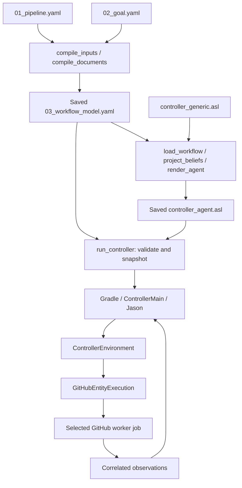

> Archived historical guidance. Use [the current manual](../../execution/guidelines/03_BDI_MANUAL_EXECUTION_GUIDE.md). Do not use these commands for the new policy.

# How the payment models become an executable BDI controller

This describes the implementation on `repair/bdi-canonical-controller`, following the persistent-project correction. It distinguishes implemented behavior from the proposed embedded-steps extension. For commands and experiment checkpoints, use the [manual walkthrough](../../execution/guidelines/03_BDI_MANUAL_EXECUTION_GUIDE.md).

## 1. Should pipeline.yaml contain the actual job steps?

**Recommendation for the current experiment: retain the working execution boundary.** The proposed richer input is feasible as a subsequent compiler extension. It is not supported by simply pasting GitHub job definitions into the current input: `compile_documents` rejects `steps`, `runs-on`, `services`, `if` and other unrecognized fields.

There are three different designs:

| Design | Where concrete job steps live | What Jason does | Assessment |
|---|---|---|---|
| Implemented | Handwritten `entity-execution.yml` | Selects a logical action such as `run_job(build, 1)` | Suitable for the existing experiment; mappings are tested |
| Proposed single-source generation | Engineer input contains job implementation blocks; compiler generates `entity-execution.yml` | Selects the same logical actions | Feasible and useful if one source for pipeline specification is a research requirement; requires implementation and tests |
| Direct interpretation | Agent/environment interprets the GitHub job language itself | Would need an execution engine for that language | Much larger change; not recommended for this experiment |

`uses: actions/checkout@v4`, `runs-on`, service containers, expressions and job timeouts are GitHub Actions execution semantics. They are not AgentSpeak operations. GitHub runners execute the steps within the selected job. See [GitHub workflow syntax](https://docs.github.com/en/actions/reference/workflows-and-actions/workflow-syntax).

An agent can select and execute a capability through its environment without knowing every shell command implementing it. Here the action is a **job**, not an individual npm or Docker step. Adding step text to the input does not automatically give Jason step-level reasoning or recovery. A step-level experiment would need step entities, preconditions, outcomes, correlation, and recovery semantics.

If the richer proposal is adopted, use a nested block such as the following **proposed, not currently accepted** schema:

```yaml
jobs:
  build:
    job_name: Build entity
    implementation:
      runs-on: ubuntu-latest
      timeout-minutes: 15
      steps:
        - uses: actions/checkout@v4
          with:
            ref: ${{ inputs.release_sha }}
        - run: npm ci
        # Remaining setup, lint, build and Docker steps go here.
```

The future project-generation phase would then:

1. Validate the logical model and the supported implementation syntax.
2. Save the implementation dictionary in `03_workflow_model.yaml`, alongside logical capabilities.
3. Generate the agent from that saved contract and `controller_generic.asl`.
4. Generate a persistent GitHub worker from the same contract. The compiler supplies dispatch inputs, entity-selection guards and execution correlation. It must not copy logical `needs` into a GitHub scheduling chain.
5. Check each worker job against its contract, include worker generation in freshness/provenance validation, and publish the worker revision before campaigns dispatch it.

Do not maintain two independent handwritten copies of the same step definitions. This extension would preserve Jason's control and GitHub's execution role. It would also retain the separation between project generation and campaigns.

A precise description for the proposal is: **“The engineer defines logical CI/CD capabilities and their job implementations in one project specification. A compiler generates the BDI controller and a GitHub execution worker. The agent chooses actions; the worker executes their implementation.”** This is defensible as the intended design, but worker generation is not implemented in the current revision.

## 2. Follow the actual generation and launch chain

All links below point to the active source or persistent output.

| Step | Input | Responsible component | Output / effect |
|---|---|---|---|
| 1. Engineer specification | Service CI/CD and deployment requirements | Engineer edits [01_pipeline.yaml](../../../bdi-cicd-framework/models/01_pipeline.yaml) and [02_goal.yaml](../../../bdi-cicd-framework/models/02_goal.yaml) | Two persistent source inputs |
| 2. Compile contract | Those two inputs | [generate_project.py](../../../bdi-cicd-framework/generate_project.py) calls `project_artifacts.generate` in [project_artifacts.py](../../../bdi-cicd-framework/project_artifacts.py); `compile_inputs` / `compile_documents` in [workflow_model.py](../../../bdi-cicd-framework/parser/workflow_model.py) reuse `parse_model` in [model_transform.py](../../../bdi-cicd-framework/parser/model_transform.py) | Saved [03_workflow_model.yaml](../../../bdi-cicd-framework/models/03_workflow_model.yaml) |
| 3. Generate agent | Saved contract plus framework policy | `generate_agent` -> `render_agent` -> `load_workflow`, then `project_beliefs(model)`; append [controller_generic.asl](../../../bdi-cicd-framework/generator/controller_generic.asl) | Saved [controller_agent.asl](../../../bdi-cicd-framework/bdi/controller_agent.asl) |
| 4. Record generation | Input, compiler, template and output content | `project_artifacts.generate` | [models/generation-manifest.json](../../../bdi-cicd-framework/models/generation-manifest.json) |
| 5. Start a campaign | Existing project artifacts, release selection, optional trusted baseline receipt | [run_controller.py](../../../bdi-cicd-framework/run_controller.py), calling `project_artifacts.validate` | A new campaign directory, exact archival copies, provenance and runtime environment variables; no regeneration |
| 6. Start Jason | Campaign artifacts and environment variables | `runController` task in [build.gradle](../../../bdi-cicd-framework/bdi/build.gradle) launches [ControllerMain.java](../../../bdi-cicd-framework/bdi/harness/ControllerMain.java) | Repository lock, snapshot hash check, then Jason `RunLocalMAS` |
| 7. Load agent/environment | Campaign copy of [controller.mas2j](../../../bdi-cicd-framework/bdi/controller.mas2j) | Jason | Agent `controller_agent` and environment `harness.ControllerEnvironment` |
| 8. Execute selected work | Agent action and entity/attempt | [ControllerEnvironment.java](../../../bdi-cicd-framework/bdi/harness/ControllerEnvironment.java) -> [GitHubEntityExecution.java](../../../bdi-cicd-framework/bdi/harness/GitHubEntityExecution.java) | Dispatch [entity-execution.yml](../../../.github/workflows/entity-execution.yml); only the selected job runs |
| 9. Return evidence | Selected GitHub run/job, readiness and correlated metrics | Java executor and telemetry adapters | Agent percepts plus campaign journal; Jason selects the next action |

The actual final agent is `bdi/controller_agent.asl`. Its actual environment is `bdi/harness/ControllerEnvironment.java`. The environment is handwritten framework code, compiled by Gradle; it is not generated from the YAML. A campaign loads an exact archived copy of the persistent agent so another project generation cannot change the running agent.



Generation is deterministic compilation, not LLM inference or planning from prose. The generic policy is predefined. The compiler specializes it with project facts; Jason evaluates those facts and live percepts at runtime.

## 3. What is adopted, derived or predefined?

The letters E, D, O and R are conceptual model categories. **The current canonical file does not contain the literal key `observable_properties(O)`.** That spelling, along with `entities(E)`, occurs in the older `model_transform.workflow_yaml` serializer. The canonical generator calls `compile_documents`, not that serializer.

| Concept | Project-specific source | Predefined framework rule | Current contract / generated agent |
|---|---|---|---|
| Entities E | Keys of `jobs` and `recovery` in input 01 | Valid lowercase entity names; normal and recovery names disjoint | `capabilities.entities`; `entity(build).`, `recovery_entity(rollback).` |
| Dependencies D | Normal jobs' `needs` | Known references, acyclic dependencies, supported single normal sink | `workflow.jobs.*.needs`; `depends(test, [build]).` |
| Required work | Achievement and maintenance entities, their dependencies and safety prerequisites | Compute transitive prerequisite closure; exclude recovery from normal goal targets | Derived `required(...)` beliefs; campaign manifest `required_entities` |
| Job implementation binding | `job_name`, `workflow_file`, optional `environment` | Dispatch an entity; match its exact selected job name | `runtime.controller`; consumed by Java, not embedded shell steps in AgentSpeak |
| Observables O | Environment bindings and metric queries; which entities to observe | Supported event signatures, status normalization, freshness checks, health policy | `capabilities.observations`, runtime telemetry bindings, live percepts |
| Observation ordering | `observe_before`, `observe_after`, health maintenance goals | Verify before continuing/achievement; bounded reconsideration of unknown | `observe_before(production, staging).`, `observe_after(production).`, `require_healthy(production).` |
| Recovery R | `recovery.rollback.from`, `on`, environment and `release_source` | Known-good source only, same environment, single recovery attempt, verify afterward | `capabilities.recovery`; `recovery(production, rollback).`, `recover_on(...)` |
| Achievement A | Input 02 `achieve(A)` | Supported form is `entity.status == success` | `achievement(production, success).` |
| Maintenance M | Input 02 `maintain(M)` | Supports `duration <= nonnegative integer` and `health == healthy`; milliseconds only | `max_duration(production, 100000).`, `require_healthy(production).` |
| Avoidance V | Input 02 `avoid(V)` | Supported success/prerequisite condition; does not evaluate arbitrary expressions | `avoid_missing(production, test).` |
| Numeric health limits | Input 02 `telemetry_constraints` | Compare measured error rate/latency; availability must be at least 1 | `error_rate_limit(0.05).`, `latency_limit(500).` |
| Retry and observation budgets | Input 01 `execution` | Bounded counts; default values for omitted optional settings | `max_retries(1).`, `observation_limit(18).`, `observation_interval(5000).` |
| Reconciliation | Input 01 count/interval settings | Resolve uncertain execution before redispatch; absence is not proof of nonexecution | `reconciliation_limit(3).`, `reconciliation_interval(5000).` |
| Decision rules | No project-specific rule synthesis | Handwritten `controller_generic.asl` | Appended intact to the generated agent |

The saved contract has `schema_version`, `workflow`, `goals`, `runtime` and `capabilities`. The capability dictionary enumerates action domains, observation argument names, recovery pairs and goal configuration. It is not evidence that a deployment has already happened. Generation validates structure and agreement; live adapters establish actual execution outcomes.

### Where observable values actually originate

| Observation / value | Actual source | Transformation |
|---|---|---|
| `status(E, Attempt, Status)` | GitHub selected job's terminal `conclusion` | `GitHubEntityExecution.normalize`: e.g. `timed_out` -> `timeout`; API/polling ambiguity -> `unknown` |
| `duration(E, Attempt, Milliseconds)` | Controller timestamp saved before dispatch until settlement | Elapsed wall time includes API/polling and waiting; it is not extracted from arbitrary console output or a step duration |
| `reconciled(E, Attempt, Round, Status)` | Read-only lookup of the same execution identity and selected job | Java publishes correlation; Jason chooses whether to continue or retry |
| Readiness | App `/ready` HTTP status | 200 -> `ready`, 503 -> `not_ready`, other/network failure -> `unknown` |
| Error rate, latency, availability | Prometheus queries in input 01 | Java reads finite, fresh aggregate samples; publishes `telemetry_measurement(E, Attempt, Round, DataStatus, Readiness, ErrorRate, LatencyP95Ms, Availability)` |
| Health / telemetry decision | The measurements above | Jason derives `allow`, `block` or `unknown`; this satisfies or fails the health goal |

Thus O is a **predefined observation vocabulary with project-specific bindings and runtime values**, not an automatically discovered list of everything printed by GitHub. GitHub supplies job outcomes; the application/monitoring stack supplies service health. Arbitrary step outputs are not currently imported as new beliefs.

### Which generic ASL file matters?

- [controller_generic.asl](../../../bdi-cicd-framework/generator/controller_generic.asl) is the active policy template. It contains normal selection, retries, telemetry classification/reobservation, execution reconciliation, recovery and completion rules.
- [bdi_generic.asl](../../../bdi-cicd-framework/generator/bdi_generic.asl) is a retained older template, referenced by the legacy `model_transform.py` CLI defaults. It is not appended by `generate_project.py` and is not loaded by the canonical MAS.
- `model_transform.py` is partly reused: `parse_model`, model structures and `project_beliefs` are active. Its old CLI and `workflow_yaml` output are not the canonical generation path.
- The older `ProjectTelemetryProvider.assess()` / `getObservations()` methods perform compatibility classification. The current `ControllerEnvironment` calls `measure()` and gives raw measurements to Jason. Do not infer the active control boundary from the old methods alone.

## 4. Concrete consistency checks

[project_artifacts.validate](../../../bdi-cicd-framework/project_artifacts.py) checks that input and generator hashes still match the saved generation record, verifies artifact hashes, reloads the contract, and compares it with a read-only compilation of the inputs. `load_workflow` reconstructs normalized bindings and capabilities and rejects disagreement.

`validate_agent` compares the complete saved agent with its deterministic projection from the saved contract and generic policy. This catches missing/extra entities, changed dependencies/action calls, removed observation or recovery facts, changed goals and edited executable policy. Updating an artifact hash alone cannot make a mismatching agent valid. This establishes agreement with the compiler/template; it is not a formal proof that the compiler/template is correct.

[test_project_artifacts.py](../../../bdi-cicd-framework/parser/test_project_artifacts.py) tests those mutations, stale/missing artifacts, generation without the original input files, and two campaigns preserving project bytes and modification times. [test_worker_contract.py](../../../bdi-cicd-framework/parser/test_worker_contract.py) checks the handwritten worker bindings and payment telemetry mappings. The worker is currently handwritten and tested; it is recorded in campaign source provenance but is not a generated artifact covered by the project generator hashes.

At launch, [ControllerMain.verifyCampaign](../../../bdi-cicd-framework/bdi/harness/ControllerMain.java) checks the archived workflow, agent and MAS hashes. [ControllerEnvironment](../../../bdi-cicd-framework/bdi/harness/ControllerEnvironment.java) only handles its predefined actions: `run_job`, `observe_telemetry`, `reconcile_job`, `accept_telemetry`, `record_recovery`, `finish`.

## 5. Where telemetry keys and values come from

The keys such as `ready_url` and `error_rate_query` are **framework configuration vocabulary**, defined/validated in [workflow_model.py](../../../bdi-cicd-framework/parser/workflow_model.py) and consumed by [ProjectConfig.java](../../../bdi-cicd-framework/bdi/harness/ProjectConfig.java), [ProjectTelemetryProvider.java](../../../bdi-cicd-framework/bdi/harness/ProjectTelemetryProvider.java) and [PrometheusTelemetryObserver.java](../../../bdi-cicd-framework/monitoring/observer/PrometheusTelemetryObserver.java). The engineer supplies their values to match the deployed service. They are not automatically copied out of the app.

### Ports and URLs

| Setting | Defined by | How it becomes the model value |
|---|---|---|
| App's internal listening port | [src/config.ts](../../../src/config.ts), [src/server.ts](../../../src/server.ts); Compose sets `PORT: 3000` | App listens on container port 3000 in both environments |
| App host port | [docker-compose.yml](../../../docker-compose.yml): `${APP_PORT:-3000}:3000` | Worker sets `APP_PORT=3001` for staging, `3000` for production; use the host port in `ready_url` |
| `/ready` route | [src/app.ts](../../../src/app.ts) | Database readiness endpoint; append `/ready` to the reachable app URL |
| Prometheus host port | Compose: `127.0.0.1:${PROMETHEUS_PORT:-9090}:9090` | Worker sets 9091 staging, 9090 production; used as `prometheus_url` |
| Collector metrics host port | Compose: `127.0.0.1:${METRICS_PORT:-9464}:9464` | 9465 staging, 9464 production; useful for inspecting `/metrics`, not the Prometheus query API |
| App-to-collector OTLP URL | Compose app environment | `http://otel-collector:4318/v1/metrics`, internal Docker network |
| Collector receiver/exporter | [otel-collector.yaml](../../../otel-collector.yaml) | Receives OTLP HTTP on 4318, exposes Prometheus metrics on 9464 |
| Prometheus scrape target | [prometheus.yml](../../../prometheus.yml) | Scrapes `otel-collector:9464` every 5 seconds inside each Compose network |
| Local example values | [.env.example](../../../.env.example) | Compose can read a local `.env`; worker shell environment supplies live overrides |

Staging's app still listens on **3000 inside its container**; Docker exposes it on **3001 on the host**. The Node app does not define Prometheus's host port. The `staging` and `production` keys are engineer-selected environment identifiers matching worker job bindings.

`127.0.0.1` is relative to the process making the request. Verify both Windows-to-WSL reachability (if applicable) and runner Docker access. On another controller host, use a suitable tunnel or reachable protected endpoint and update/regenerate the model; merely replacing loopback with an IP does not expose the loopback-bound Prometheus port.

### Metrics, labels and queries

[src/telemetry.ts](../../../src/telemetry.ts) defines the instruments. The collector's Prometheus exporter exposes their Prometheus representation. Inspect its actual `/metrics` output when adapting a new application.

| App instrument | Prometheus name used by the contract | Meaning |
|---|---|---|
| `payment.http.requests` counter | `payment_http_requests_total` | HTTP requests, with route/status labels |
| `payment.http.errors` counter | `payment_http_errors_total` | HTTP 4xx/5xx responses; the contract selects only `/payments` 5xx |
| `payment.http.request.duration` histogram, unit `ms` | `payment_http_request_duration_milliseconds_bucket` | Bucketed request latency |
| `payment.service.ready` gauge | `payment_service_ready` | 1 when ready, otherwise 0 |

The adapter replaces `{{run_id}}` in each query with the **execution UUID**, not the GitHub numeric run ID. Java sends that UUID as worker input `execution_id`; the worker sets `CI_RUN_ID`; Compose passes it to Node; telemetry attaches `ci_run_id`. `/health` exposes the same value as `deploymentRunId`.

| Model key / constant | Who chooses it | Interpretation |
|---|---|---|
| `error_rate_query` | Engineer | Rate of `/payments` 5xx divided by all `/payments` requests for this execution over 2 minutes. `or vector(0)` handles absent error series; `clamp_min(..., 0.001)` bounds a near-zero denominator. It is not a general proof of healthy traffic. |
| `latency_p95_ms_query` | Engineer | Estimate the 95th percentile from per-bucket rates, summing by `le`; returned units are ms. See [Prometheus histogram guidance](https://prometheus.io/docs/practices/histograms/). |
| `availability_query` | Engineer | Minimum readiness gauge for the execution; not a long-term uptime percentage |
| `sample_age_seconds_query` | Engineer | Prometheus evaluation time minus the selected readiness sample timestamp; not a full distributed tracing freshness proof |
| `max_age_seconds: 30` | Engineer | Adapter freshness tolerance; not an app port, timeout or export interval |
| `[2m]`, `0.95`, `0.001` | Engineer | Query window, percentile and denominator floor; these are monitoring choices |
| `0.05`, `500` in input 02 | Engineer | Maximum accepted error ratio (5%) and p95 latency (500 ms), applied by Jason |

The app exports every 5 seconds. The collector expires metrics after 15 seconds without updates; Prometheus scrapes every 5 seconds. These settings are separate from the 30-second adapter age limit. Missing/ambiguous/nonfinite samples remain unknown. Fresh readiness alone does not compensate for missing latency samples; generate traffic and inspect the correlated histogram.

None of these PromQL strings is shown in the checkout UI. View raw exported metrics at the collector's `/metrics`, query results in the Prometheus UI/API, deployment identity at `/health`, and accepted measurements/decisions in the campaign journal and Jason mind inspector.

## 6. Verification for this explanation

Checked against the local implementation on 20 September 2026: persistent-artifact validation passed, all 36 Python contract/mapping tests passed, and the saved payment agent plus `ControllerEnvironment` completed a healthy campaign with simulated execution/telemetry (`achieved`, `not_needed`). This verifies the load/execution path locally, not a live GitHub deployment. The walkthrough's 25 PowerShell command blocks were syntax-checked without executing their live commands; local documentation links were checked. The user's additions to `docs/resources-and-plans/06_WORKING_NOTES.md` were preserved.
